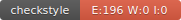

# UCE Génie Logiciel Avancé : Techniques de tests

## Introduction

Vous allez à travers ces projet mettre en application une partie des aspects évoqués en cours vis à vis des techniques de tests.  
Pour cela nous allons réaliser un projet logiciel de petite taille, en suivant la roadmap suivante : 
- Setup du projet
- Mise en place des outils d’intégration continue
- Écriture des tests unitaires
- Écriture des mocks, et validation des tests
- Développement dirigé par les tests
- Documentation et conventions de style
- Test d'une implémentation donnée

Le projet consiste à mettre en place un outil d’analyse statistique pour le jeu Pokémon GO.  
Durant cette série de TPs, le gestionnaire de version Git sera utilisé à foison, à travers la plateforme GitHub. Si vous n’êtes pas à l’aise avec cet outil[^1], [voici](http://rogerdudler.github.io/git-guide/) un petit guide à garder sous la main.

## Sujets

L'ensemble des sujets de TPs peut être trouvé dans le dossier `TPs`.

Le dossier `src` contient la définition de l'ensemble des interfaces qui seront l'objet de vos travaux.

## Rendus

Le rendu des TPs se fait au rythme suivant :

- TP1 : 1ère séance
- TP2 : 2ème séance
- TP3 : 3ème séance
- TP4 : 5ème séance
- TP5 : dernière séance
- TP6 : dernière séance

Pour chaque rendu, le projet dans son intégralité doit être déposé sur la plateforme.

## Badges

